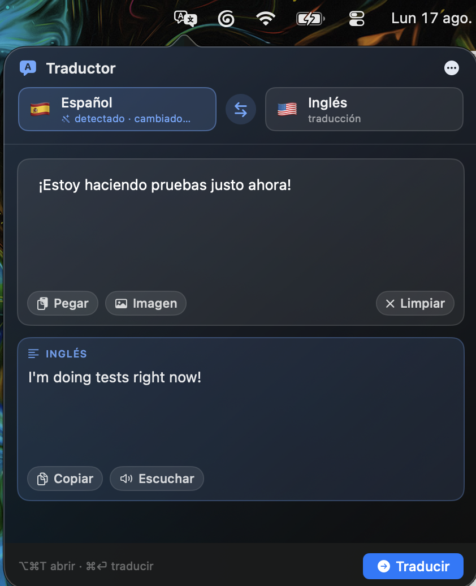

<h1 align="center">🌐 Traductor</h1>

<p align="center"><b>Traduce español ↔ inglés desde la barra de menús, sin que nada salga de tu Mac.</b></p>

<p align="center">
Un clic o <b>⌥⌘T</b> desde cualquier app, pegas texto <b>o</b> una imagen, y tienes la
traducción. Detecta el idioma solo, lee el texto de las imágenes y corrige la
gramática. Sin API keys, sin cuentas y sin conexión a internet.
</p>

<p align="center">
  
  
  
  
  
  
</p>

<p align="center">
  
</p>

## Cómo se usa

- **Clic en el ícono** de la barra de menús, o **⌥⌘T** desde cualquier app.
- Al abrirse toma automáticamente lo que tengas copiado (texto o imagen) y lo traduce.
- También puedes **arrastrar una imagen** al panel o elegirla con el botón *Imagen*.
- **⌘⏎** traduce · **⇧⌘V** pega · **⇧⌘C** copia el resultado.
- Clic derecho en el ícono → *Abrir al iniciar sesión* / *Salir*.

## Detección que manda siempre

No hay que elegir idioma nunca. La detección pesa más que cualquier selección:
si el panel dice *Español* y pegas inglés, la app se cambia sola y te traduce al
español. El pill de origen muestra qué detectó y el botón ⇄ invierte la dirección
a mano cuando hace falta.

Sólo cuando el texto es demasiado corto o ambiguo (confianza bajo 0,60) se usa el
último idioma conocido como respaldo.

## Corrección de gramática

Mientras traduce, la app revisa el texto de entrada en su idioma y, si encuentra
errores de ortografía, tildes, puntuación o concordancia, propone una versión
corregida en una tarjeta verde. Nada se aplica sin que pulses *Usar corrección*.

El check **Corregir**, junto a *Pegar* e *Imagen*, activa o desactiva la revisión.
Mientras revisa, ese mismo check muestra el avance. La preferencia se recuerda
entre sesiones y también está en el menú `…`.

La corrección la hace el modelo on‑device de Apple Intelligence. Si responde algo
que no se parece al original —divaga, resume o filtra sus propias instrucciones—
la propuesta se descarta y se reintenta. Cuando aun así no hay una corrección
fiable, la app prefiere **no proponer nada** antes que sugerir un disparate.

En equipos sin Apple Intelligence el respaldo es `NSSpellChecker`, que corrige
palabra por palabra y por tanto acierta menos.

## Privacidad: nada sale de tu Mac

No es una promesa del código, la impone el sistema operativo. La app se firma con
**App Sandbox activado y sin ningún permiso de red**:

```xml
<key>com.apple.security.app-sandbox</key><true/>
<key>com.apple.security.files.user-selected.read-only</key><true/>
```

Al no declarar `com.apple.security.network.client` ni `.network.server`, el kernel
**bloquea cualquier conexión** que intente abrir este proceso. Puedes comprobarlo
en tu propia copia:

```bash
codesign -d --entitlements - --xml /Applications/Traductor.app | plutil -p -
```

Además, `build.sh` falla la compilación si algún día aparece un permiso de red en
los entitlements, y no hay una sola línea de código de red en el repositorio:

```bash
grep -rn "URLSession\|https://" Sources/    # sin resultados
```

Tampoco hay acceso al disco: sólo se leen los archivos que eliges tú en el diálogo
de *Imagen*. No hay analítica, ni telemetría, ni cuentas, ni API keys.

## Cómo traduce

Todo ocurre dentro del equipo, con frameworks que ya vienen en macOS:

| Parte | Tecnología | Costo |
|---|---|---|
| Texto | `Translation` de macOS | gratis, sin cuenta |
| Imagen → texto | `Vision` OCR | gratis |
| Detección de idioma | `NaturalLanguage` | gratis |
| Gramática | `FoundationModels` (Apple Intelligence) | gratis |
| Gramática (respaldo) | `NSSpellChecker` | gratis |

La primera vez aparece un aviso para **descargar los idiomas**: macOS los baja una
sola vez y desde ahí la app traduce sin conexión. Si no están descargados, la app
te lo dice y no traduce — antes que mandar tu texto a un servicio de terceros,
prefiere no hacer nada.

## Compilar

```bash
./build.sh          # genera build/Traductor.app
open build/Traductor.app
```

Requiere macOS 15+ y las herramientas de Xcode. No hace falta abrir Xcode ni crear
un proyecto: `build.sh` compila con `swiftc` y arma el bundle.

Para instalarla:

```bash
cp -R build/Traductor.app /Applications/
open /Applications/Traductor.app
```

La app se firma **ad‑hoc** (`codesign --sign -`), o sea con tu propio equipo y sin
certificado de desarrollador de Apple. Por eso se compila en vez de descargarse:
así cada quien corre exactamente el código que puede leer en este repositorio, y
no hay un binario opaco de por medio.

## Estructura

```
Sources/ChelkiTranslate/
  App.swift               punto de entrada (LSUIElement, sin ícono en el Dock)
  AppDelegate.swift       ícono de la barra, popover, atajo global
  ContentView.swift       toda la interfaz
  TranslatorModel.swift   estado, detección, OCR y descarga de idiomas
  TranslationEngine.swift disponibilidad de idiomas y errores
  GrammarService.swift    corrección con Apple Intelligence / NSSpellChecker
  OCRService.swift        lectura de texto en imágenes con Vision
  Language.swift          idiomas y detección automática
  Support.swift           atajo ⌥⌘T, arranque automático, lectura en voz alta
Resources/Info.plist
build.sh
```

## Prueba de humo

Verifica de una pasada la detección dominante, la traducción en los dos sentidos
y la corrección gramatical:

```bash
CHELKI_SELFTEST=1 ./build/Traductor.app/Contents/MacOS/Traductor
# fijado=ES texto=EN → detectó EN, traduce a ES: Oye, ¿puedes enviarme el informe antes del mediodía?
# fijado=EN texto=ES → detectó ES, traduce a EN: Hey, can you send me the report before noon?
# modelo on-device: disponible
# corrigió [appleIntelligence] → Fui al banco y no había nadie atendiendo porque era feriado.
```
